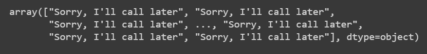

# Implementation-of-SVM-For-Spam-Mail-Detection

## AIM:
To write a program to implement the SVM For Spam Mail Detection.

## Equipments Required:
1. Hardware – PCs
2. Anaconda – Python 3.7 Installation / Jupyter notebook

## Algorithm
1. Import dataset using chardet
2. Get the dataset info and check for null values
3. Assign x and y values
4. Split it into train and test data
5. Import count vectorizer and transform x_train and x_test as vectors
6. Import SVC and fit it to data
7. Find y_predict values and accuracy


## Program:
```
/*
Program to implement the SVM For Spam Mail Detection..
Developed by: Aswathi S
Register Number: 212220040020
*/
```

## Output:
1. result\

2. data.head()\

3. data.info()\

4. data.isnull().sum()\

5. y_pred\

6. accuracy\


## Result:
Thus the program to implement the SVM For Spam Mail Detection is written and verified using python programming.